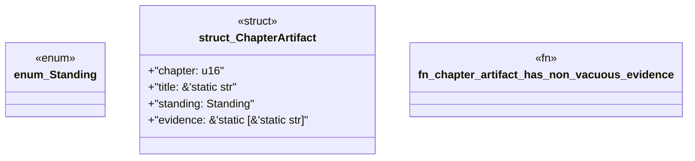

# `book/src/listings/appendix-T-appendix-t-glossary.rs`

Source SHA-256: `3239cea41c581b3de06fcbf63f4e0d0deca54111dd784d706d950f264648d770`

## Dependencies

- None observed.

## Standing

- Structural parse: `ALIVE`
- Runtime behavior: `UNKNOWN`
