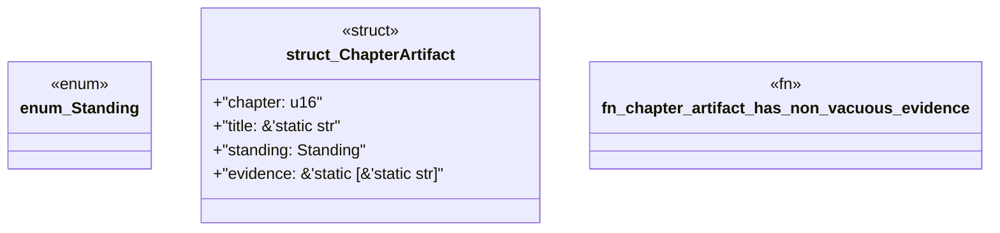

# `book/src/listings/appendix-U-appendix-u-bibliography-and-project-record.rs`

Source SHA-256: `0a4f5bca70a8e30032f5cc856fb2d4d7227d76ee6f66c121a01c1a42df1ff95c`

## Dependencies

- None observed.

## Standing

- Structural parse: `ALIVE`
- Runtime behavior: `UNKNOWN`
