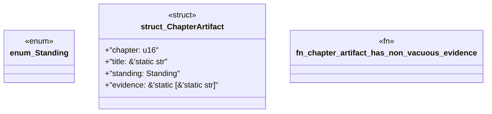

# `book/src/listings/appendix-V-appendix-v-index.rs`

Source SHA-256: `0acf6fee675eef792bbc0878c682f652c59f8c4f6fa1030b713d327a67287b53`

## Dependencies

- None observed.

## Standing

- Structural parse: `ALIVE`
- Runtime behavior: `UNKNOWN`
