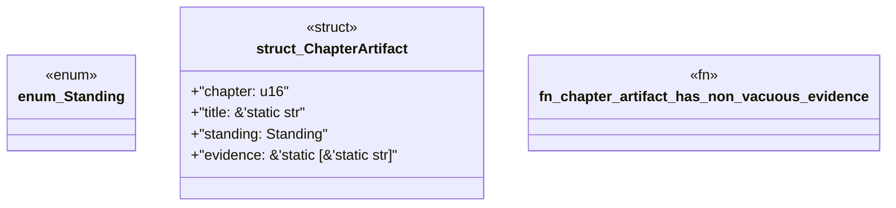

# `book/src/listings/appendix-x-how-to-read-the-book.rs`

Source SHA-256: `246fec98f9865d40540f3f88d0c38ad16899023f8ecb9fd830b2d393b19dd6c7`

## Dependencies

- None observed.

## Standing

- Structural parse: `ALIVE`
- Runtime behavior: `UNKNOWN`
