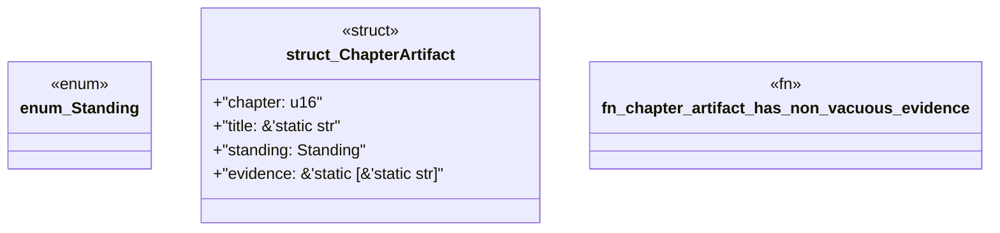

# `book/src/listings/appendix-x-the-continuous-tcps-case-study.rs`

Source SHA-256: `a2f4b27fbca7224872ba4b520298b720879bb6991bd6791ba104257813063ecf`

## Dependencies

- None observed.

## Standing

- Structural parse: `ALIVE`
- Runtime behavior: `UNKNOWN`
