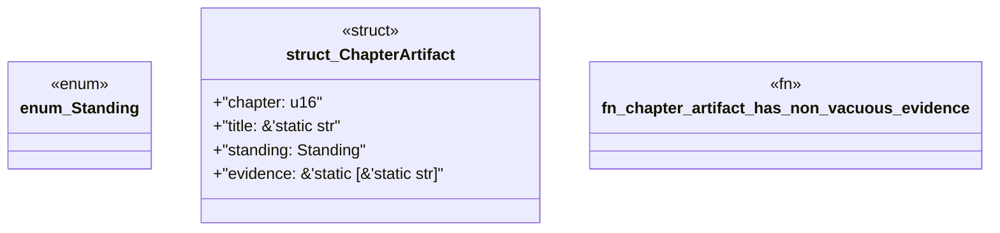

# `book/src/listings/appendix-x-the-final-acceptance-test.rs`

Source SHA-256: `7feb6be3d383f916477fe499ee38d790a2958df40ad41f05acb2417d965d45ad`

## Dependencies

- None observed.

## Standing

- Structural parse: `ALIVE`
- Runtime behavior: `UNKNOWN`
