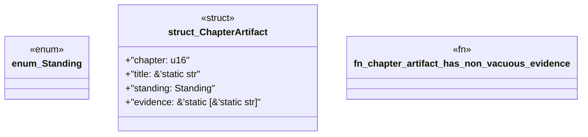

# `book/src/listings/appendix-x-what-a-level-five-pack-produces.rs`

Source SHA-256: `513d142fbea88cfad7dbf282fea788daaf3e2c35d76286f7aaa7e4f259e6f2d3`

## Dependencies

- None observed.

## Standing

- Structural parse: `ALIVE`
- Runtime behavior: `UNKNOWN`
