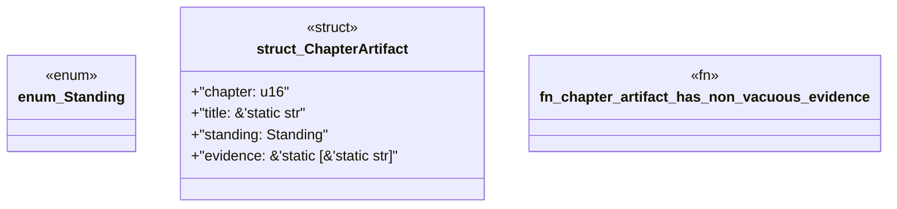

# `book/src/listings/appendix-x-who-this-book-is-for.rs`

Source SHA-256: `079dfd5e6f3a71deb407e53dd4e54066d5ee2f85f8f1680782c6a333f2efd3eb`

## Dependencies

- None observed.

## Standing

- Structural parse: `ALIVE`
- Runtime behavior: `UNKNOWN`
