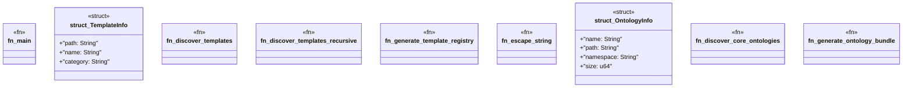

# `build.rs`

Source SHA-256: `0369559c2d68be9f71e943a267f1bd3cf4b3eadcd4f4121e0936ab93c5ef0b58`

## Dependencies

- `std::env`
- `std::fs::{self, File}`
- `std::io::Write`
- `std::path::Path`

## Standing

- Structural parse: `ALIVE`
- Runtime behavior: `UNKNOWN`
