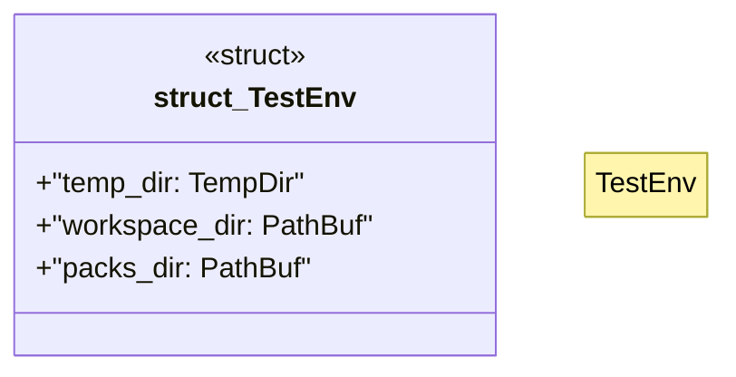

# `cgen/crates/ggen-cli/tests/packs/integration_test.rs`

Source SHA-256: `8209f95590889f19e9b759fe468723e5f88fe0adf03b87713bf3ea87da636376`

## Dependencies

- `std::fs`
- `std::path::{Path, PathBuf}`
- `tempfile::TempDir`

## Standing

- Structural parse: `ALIVE`
- Runtime behavior: `UNKNOWN`
