# `crates/bcinr-mfw-ir/src/causal.rs`

Source SHA-256: `2c9cd089a54c6f17c25827b4f7256f64976a62d78f74c10ee4134ec7c865a07c`

```mermaid
classDiagram
    class struct_ActionPair {
      <<struct>>
      +"left: ActionOccurrenceId"
      +"right: ActionOccurrenceId"
    }
    class struct_EffectsCommuteWitness {
      <<struct>>
      +"commute: bool"
      +"left_effects_digest: Digest"
      +"right_effects_digest: Digest"
      +"shared_atoms: BTreeSet~AtomId~"
      +"shared_fluents: BTreeSet~FluentId~"
    }
    class struct_PreconditionsStableWitness {
      <<struct>>
      +"stable: bool"
      +"left_preconditions_digest: Digest"
      +"right_preconditions_digest: Digest"
      +"threatened_atoms: BTreeSet~AtomId~"
    }
    class struct_InvariantsStableWitness {
      <<struct>>
      +"stable: bool"
      +"invariants_digest: Digest"
      +"checked_invariants: BTreeSet~InvariantId~"
    }
    class struct_NumericFlowWitness {
      <<struct>>
      +"commute: bool"
      +"flow_digest: Digest"
      +"touched_fluents: BTreeSet~FluentId~"
    }
    class struct_TrajectoryWitness {
      <<struct>>
      +"consistent: bool"
      +"trajectory_digest: Digest"
      +"checked_constraints: BTreeSet~ConstraintId~"
    }
    class struct_IndependenceWitness {
      <<struct>>
      +"effects_commute: EffectsCommuteWitness"
      +"preconditions_stable: PreconditionsStableWitness"
      +"invariants_stable: InvariantsStableWitness"
      +"numeric_flow: NumericFlowWitness"
      +"trajectory: TrajectoryWitness"
    }
    class enum_DependenceReason {
      <<enum>>
    }
    class struct_DependenceWitness {
      <<struct>>
      +"reasons: BTreeSet~DependenceReason~"
      +"threatened_atoms: BTreeSet~AtomId~"
    }
    class enum_IndependenceVerdict {
      <<enum>>
    }
    class struct_IndependenceRelation {
      <<struct>>
      +"independent: BTreeMap~ActionPair"
      +"dependent: BTreeMap~ActionPair"
    }
    class struct_PrecedenceEdge {
      <<struct>>
      +"before: ActionOccurrenceId"
      +"after: ActionOccurrenceId"
    }
    class struct_StrictPartialOrder {
      <<struct>>
      +"edges: BTreeSet~PrecedenceEdge~"
    }
    class enum_SupportObject {
      <<enum>>
    }
    class struct_CausalSupportEdge {
      <<struct>>
      +"producer: ActionOccurrenceId"
      +"consumer: ActionOccurrenceId"
      +"fact: SupportObject"
    }
    class struct_ActionOccurrence {
      <<struct>>
      +"id: ActionOccurrenceId"
      +"action: u64"
    }
    class struct_CausalPlan {
      <<struct>>
      +"epoch: PlanningEpochId"
      +"occurrences: Vec~ActionOccurrence~"
      +"precedes: StrictPartialOrder"
      +"independence: IndependenceRelation"
      +"support_edges: BTreeSet~CausalSupportEdge~"
      +"digest: Digest"
    }
    class trait_CausalAnalyzer {
      <<trait>>
      +"analyze(
        &self, epoch: &Self::Epoch, occurrences: &[ActionOccurrence],
    ) -~ Result~CausalPlan, Self::Error~"
    }
    class mod_tests {
      <<mod>>
    }
    note "ActionPair"
```

## Dependencies

- `crate::digest::Digest`
- `crate::ids::{ActionOccurrenceId, PlanningEpochId}`
- `std::collections::{BTreeMap, BTreeSet}`
- `super::*`

## Standing

- Structural parse: `ALIVE`
- Runtime behavior: `UNKNOWN`
