# `crates/bcinr-mfw-ir/src/concurrency.rs`

Source SHA-256: `ebb28ad12e7d66101f42d7ee8d6ef1246eaaea084d7d69d184dc59aa708c8d74`

```mermaid
classDiagram
    class struct_MinimalNonFace {
      <<struct>>
      +"members: EventSet"
      +"witness_digest: Digest"
    }
    class struct_ResourceConflictWitness {
      <<struct>>
      +"actions: EventSet"
      +"resource: FluentId"
      +"capacity_milli: i64"
      +"demanded_milli: i64"
    }
    class struct_ConcurrencyConflictWitness {
      <<struct>>
      +"causal: Option~(ActionPair"
      +"temporal: Option~(EventSet"
      +"resource: Option~ResourceConflictWitness~"
    }
    class struct_ExecutableConcurrencyComplex {
      <<struct>>
      +"event_count: usize"
      +"minimal_nonfaces: Vec~MinimalNonFace~"
      +"conflict_witnesses: BTreeMap~Digest"
      +"digest: Digest"
    }
    class trait_ConcurrencyAnalyzer {
      <<trait>>
      +"analyze(
        &self, epoch: &Self::Epoch, causal: &CausalPlan,
    ) -~ Result~ExecutableConcurrencyComplex, Self::Error~"
    }
    class mod_tests {
      <<mod>>
    }
    note "ExecutableConcurrencyComplex"
```

## Dependencies

- `crate::causal::{ActionPair, CausalPlan, FluentId, InvariantId, PrecedenceEdge}`
- `crate::digest::Digest`
- `crate::event_set::EventSet`
- `std::collections::BTreeMap`
- `std::collections::BTreeSet`
- `super::*`

## Standing

- Structural parse: `ALIVE`
- Runtime behavior: `UNKNOWN`
