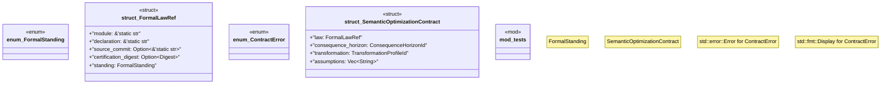

# `crates/bcinr-mfw-ir/src/contracts.rs`

Source SHA-256: `efc1144f85d03707e6b93e573940ce7ffbaf0bfbafbaa2554e37186f940f58f0`

## Dependencies

- `crate::digest::Digest`
- `crate::ids::{ConsequenceHorizonId, TransformationProfileId}`
- `super::*`

## Standing

- Structural parse: `ALIVE`
- Runtime behavior: `UNKNOWN`
