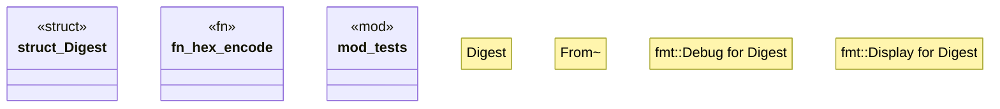

# `crates/bcinr-mfw-ir/src/digest.rs`

Source SHA-256: `47191e7900b681dff33929b2e3f37ea12b0cf8b692c54807fef459153b499ab4`

## Dependencies

- `std::fmt`
- `super::*`

## Standing

- Structural parse: `ALIVE`
- Runtime behavior: `UNKNOWN`
