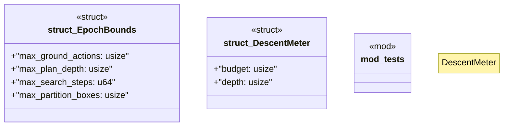

# `crates/bcinr-mfw-ir/src/epoch.rs`

Source SHA-256: `4f4a3417e35760b16b8b6090d12eee01a90ae3509736088e1ec2c7db618f4f12`

## Dependencies

- `crate::outcome::{BoundHit, BoundKind}`
- `super::*`

## Standing

- Structural parse: `ALIVE`
- Runtime behavior: `UNKNOWN`
