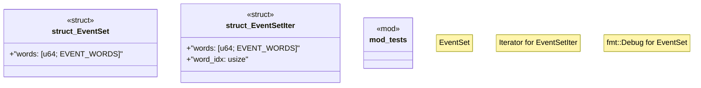

# `crates/bcinr-mfw-ir/src/event_set.rs`

Source SHA-256: `346b6738cbb48d504fd4e17a75f6b2cbdcab3073f375ce290b29feed7283cf47`

## Dependencies

- `std::fmt`
- `super::*`

## Standing

- Structural parse: `ALIVE`
- Runtime behavior: `UNKNOWN`
