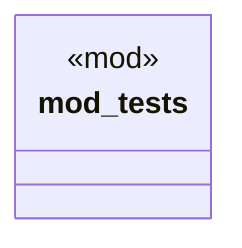

# `crates/bcinr-mfw-ir/src/ids.rs`

Source SHA-256: `941c9fdaca90abbbffe20a9faf6f29c9b889bd575eb60d9f2efe7d487c4592fc`

## Dependencies

- `crate::digest::Digest`
- `super::*`

## Standing

- Structural parse: `ALIVE`
- Runtime behavior: `UNKNOWN`
