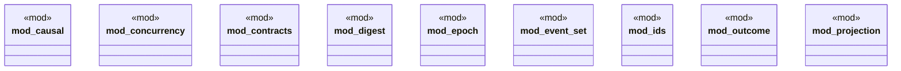

# `crates/bcinr-mfw-ir/src/lib.rs`

Source SHA-256: `ba534bb812683df802ddb1a4e258e7f875bad8e34863210c3bb0459d1471a065`

## Dependencies

- `causal::{ ActionOccurrence, ActionPair, AtomId, CausalAnalyzer, CausalPlan, CausalSupportEdge, ConstraintId, DependenceReason, DependenceWitness, EffectsCommuteWitness, FluentId, IndependenceRelation, IndependenceVerdict, IndependenceWitness, InvariantId, InvariantsStableWitness, NumericFlowWitness, PrecedenceEdge, PreconditionsStableWitness, StrictPartialOrder, SupportObject, TrajectoryWitness, }`
- `concurrency::{ ConcurrencyAnalyzer, ConcurrencyConflictWitness, ExecutableConcurrencyComplex, MinimalNonFace, ResourceConflictWitness, }`
- `contracts::{ ContractError, FormalLawRef, FormalStanding, SemanticOptimizationContract, LAW_CONCURRENCY_COMPLEX_DOWNWARD_CLOSED, LAW_CROWN_KERNEL_CHARACTERIZATION, LAW_EXECUTABLE_CONCURRENCY_INTERSECTION, LAW_MINIMAL_NONFACE_REPRESENTATION, LAW_OBSERVABLE_IFF_FIBER_CONSTANT, LAW_QLENS_RATIO, LAW_SPECTRUM_ESTIMATOR, }`
- `digest::Digest`
- `epoch::{DescentMeter, EpochBounds}`
- `event_set::{EventSet, EventSetIter, EVENT_WORDS, MAX_EPOCH_EVENTS}`
- `ids::{ ActionOccurrenceId, ConsequenceHorizonId, MeasureProfileId, PlanningEpochId, PowlNodeId, SearchProfileId, SelectorProfileId, TransformationProfileId, }`
- `outcome::{ BoundHit, BoundKind, ExhaustionWitness, InconsistencyWitness, PlannerFailure, PlannerOutcome, UnsupportedFeature, }`
- `projection::{ ActionNodeBijection, ConcurrencyPreservationWitness, OrderPreservationWitness, PowlProjectionWitness, PowlProjector, }`

## Standing

- Structural parse: `ALIVE`
- Runtime behavior: `UNKNOWN`
