# `crates/bcinr-mfw-ir/src/projection.rs`

Source SHA-256: `2a41dabeada565dfbd9d610b5c8e1074100c345ccb01f5f515bc2327b7742ee7`

```mermaid
classDiagram
    class struct_ActionNodeBijection {
      <<struct>>
      +"action_to_node: BTreeMap~ActionOccurrenceId"
      +"node_to_action: BTreeMap~PowlNodeId"
    }
    class struct_OrderPreservationWitness {
      <<struct>>
      +"source_order_digest: Digest"
      +"projected_order_digest: Digest"
      +"mapped_order_digest: Digest"
    }
    class struct_ConcurrencyPreservationWitness {
      <<struct>>
      +"source_complex_digest: Digest"
      +"mapped_source_digest: Digest"
      +"target_complex_digest: Digest"
    }
    class struct_PowlProjectionWitness {
      <<struct>>
      +"source_epoch: PlanningEpochId"
      +"causal_plan_digest: Digest"
      +"source_concurrency_digest: Digest"
      +"action_node_bijection: ActionNodeBijection"
      +"order_witness: OrderPreservationWitness"
      +"concurrency_witness: ConcurrencyPreservationWitness"
      +"digest: Digest"
    }
    class trait_PowlProjector {
      <<trait>>
      +"project(
        &self, causal: &CausalPlan, concurrency: &ExecutableConcurrencyComplex,
    ) -~ Result~(Self::Model, PowlProjectionWitness), Self::Error~"
    }
    class mod_tests {
      <<mod>>
    }
```

## Dependencies

- `crate::causal::CausalPlan`
- `crate::causal::{ActionOccurrence, IndependenceRelation, StrictPartialOrder}`
- `crate::concurrency::ExecutableConcurrencyComplex`
- `crate::digest::Digest`
- `crate::ids::{ActionOccurrenceId, PlanningEpochId, PowlNodeId}`
- `std::collections::BTreeMap`
- `std::collections::BTreeSet`
- `super::*`

## Standing

- Structural parse: `ALIVE`
- Runtime behavior: `UNKNOWN`
