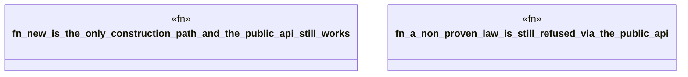

# `crates/bcinr-mfw-ir/tests/contract_construction.rs`

Source SHA-256: `482d12c0b21127c74463dfe921a262c17fa678ea5144fb7301cc05a562dc8cf6`

## Dependencies

- `bcinr_mfw_ir::{ ConsequenceHorizonId, Digest, FormalStanding, SemanticOptimizationContract, TransformationProfileId, LAW_QLENS_RATIO, LAW_SPECTRUM_ESTIMATOR, }`

## Standing

- Structural parse: `ALIVE`
- Runtime behavior: `UNKNOWN`
