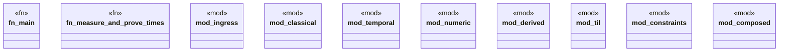

# `crates/bcinr-pddl/benches/pddl_80_20.rs`

Source SHA-256: `900445aae0e987ca56d8c92af28835edef695e48cbd2ce7513cd06ae8bf8eea1`

## Dependencies

- `bcinr_pddl::{ domain_from_pddl, powl_bridge::temporal_plan_to_powl_tape, problem_from_pddl, GroundProblem, GroundTemporalProblem, }`
- `divan::Bencher`
- `std::time::Instant`
- `super::*`

## Standing

- Structural parse: `ALIVE`
- Runtime behavior: `UNKNOWN`
