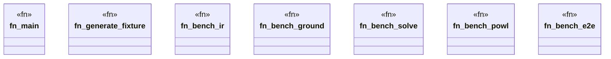

# `crates/bcinr-pddl/benches/scaling.rs`

Source SHA-256: `f3fec0a05cc9a70d068f40955f9b635d869782403d77264f128895b4de7d9930`

## Dependencies

- `bcinr_pddl::{ domain_from_pddl, powl_bridge::temporal_plan_to_powl_tape, problem_from_pddl, GroundTemporalProblem, }`
- `divan::{bench, black_box, Bencher}`

## Standing

- Structural parse: `ALIVE`
- Runtime behavior: `UNKNOWN`
