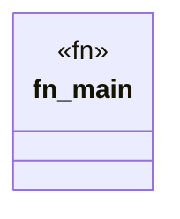

# `crates/bcinr-pddl/examples/dfcm_alloc_profile.rs`

Source SHA-256: `9ed40372b2aa241e7f975280e887abd43efd1e22440d608853f3466206d044c4`

## Dependencies

- None observed.

## Standing

- Structural parse: `ALIVE`
- Runtime behavior: `UNKNOWN`
