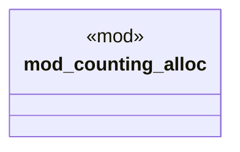

# `crates/bcinr-pddl/src/alloc_counter.rs`

Source SHA-256: `e764922efbd51f23fcf33b37219399bd98c15f5f719c0480f4650d28ed938d9f`

## Dependencies

- `std::alloc::{GlobalAlloc, Layout, System}`
- `std::sync::atomic::{AtomicU64, Ordering}`

## Standing

- Structural parse: `ALIVE`
- Runtime behavior: `UNKNOWN`
