# `crates/bcinr-pddl/src/capability_router.rs`

Source SHA-256: `069960804d02fd8d7f33866a1c343b6fd596a1ee43caf79e7d3c1be021f7cdae`

```mermaid
classDiagram
    class enum_DesiredEffect {
      <<enum>>
    }
    class struct_CapabilityTask {
      <<struct>>
      +"desired_effects: Vec~DesiredEffect~"
      +"attention_capacity: u32"
    }
    class struct_CostVector {
      <<struct>>
      +"admitted: bool"
      +"unreceipted_mutation_risk: u8"
      +"human_attention_seconds: f64"
      +"token_cost: u64"
      +"latency_ms: u64"
      +"context_switches: u8"
    }
    class struct_CapabilityRouteReceipt {
      <<struct>>
      +"admitted: bool"
      +"refusal_reason: Option~String~"
      +"plan: TemporalPlan"
      +"analysis: Option~ScheduleAnalysis64~"
      +"cost: CostVector"
      +"route_chain: String"
    }
    class fn_build_problem_text {
      <<fn>>
    }
    class fn_route_chain_hash {
      <<fn>>
    }
    class fn_hex {
      <<fn>>
    }
    class fn_route_capability_plan {
      <<fn>>
    }
    class mod_tests {
      <<mod>>
    }
    note "CostVector"
    note "DesiredEffect"
    note "Eq for CostVector"
    note "Ord for CostVector"
    note "PartialOrd for CostVector"
```

## Dependencies

- `blake3::Hasher`
- `crate::ground::GroundTemporalProblem`
- `crate::schedule_analysis::{analyze_schedule, ScheduleAnalysis64}`
- `crate::{domain_from_pddl, problem_from_pddl, Pddl8Domain, Pddl8Error}`
- `std::cmp::Ordering`
- `std::sync::OnceLock`
- `std::thread`
- `super::*`
- `wasm4pm_compat::pddl::TemporalPlan`

## Standing

- Structural parse: `ALIVE`
- Runtime behavior: `UNKNOWN`
