# `crates/bcinr-pddl/src/causal.rs`

Source SHA-256: `166d8a9d093749cfd1076d11d959b131cf92dd04dbe759ad4b3d81be286e9cea`

```mermaid
classDiagram
    class struct_PddlCausalAnalyzer {
      <<struct>>
    }
    class enum_CausalAnalysisError {
      <<enum>>
    }
    class fn_simulate_two {
      <<fn>>
    }
    class fn_analyze_pair {
      <<fn>>
    }
    class fn_atom_id {
      <<fn>>
    }
    class fn_effects_digest {
      <<fn>>
    }
    class fn_preconditions_digest {
      <<fn>>
    }
    class mod_tests {
      <<mod>>
    }
    note "CausalAnalyzer for PddlCausalAnalyzer"
    note "std::error::Error for CausalAnalysisError"
    note "std::fmt::Display for CausalAnalysisError"
```

## Dependencies

- `bcinr_mfw_ir::{ ActionOccurrence, ActionPair, AtomId, CausalAnalyzer, CausalPlan, CausalSupportEdge, DependenceReason, DependenceWitness, Digest, EffectsCommuteWitness, IndependenceRelation, IndependenceWitness, InvariantsStableWitness, NumericFlowWitness, PrecedenceEdge, PreconditionsStableWitness, StrictPartialOrder, SupportObject, TrajectoryWitness, }`
- `bcinr_mfw_ir::{ActionOccurrenceId, EpochBounds, PlanningEpochId}`
- `crate::capability::GroundedPlanningEpoch`
- `crate::ground::GroundProblem`
- `crate::parse::{domain_from_pddl, problem_from_pddl}`
- `std::collections::{BTreeMap, BTreeSet}`
- `super::*`
- `wasm4pm_compat::pddl::{Pddl8GroundAction, Pddl8GroundAtom}`

## Standing

- Structural parse: `ALIVE`
- Runtime behavior: `UNKNOWN`
