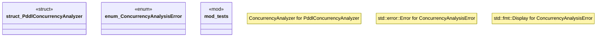

# `crates/bcinr-pddl/src/concurrency.rs`

Source SHA-256: `922e58faa9c7885e004e7f5f2ce5619648648b0dd56dc7c28b3f1de5639813f6`

## Dependencies

- `bcinr_mfw_ir::{ ActionOccurrence, ActionOccurrenceId, CausalAnalyzer, EpochBounds, PlanningEpochId, }`
- `bcinr_mfw_ir::{ ActionOccurrenceId, CausalPlan, ConcurrencyAnalyzer, ConcurrencyConflictWitness, Digest, EventSet, ExecutableConcurrencyComplex, MinimalNonFace, MAX_EPOCH_EVENTS, }`
- `bcinr_mfw_ir::{ ActionPair, CausalPlan, DependenceReason, DependenceWitness, IndependenceRelation, StrictPartialOrder, }`
- `crate::capability::GroundedPlanningEpoch`
- `crate::causal::PddlCausalAnalyzer`
- `crate::ground::GroundProblem`
- `crate::parse::{domain_from_pddl, problem_from_pddl}`
- `std::collections::BTreeMap`
- `std::collections::{BTreeMap, BTreeSet}`
- `super::*`

## Standing

- Structural parse: `ALIVE`
- Runtime behavior: `UNKNOWN`
