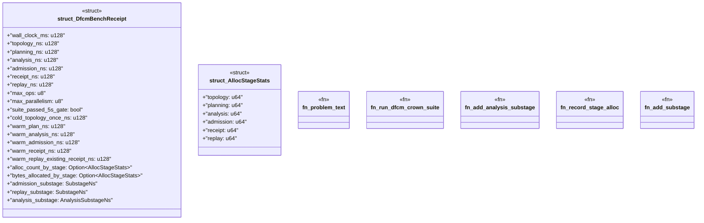

# `crates/bcinr-pddl/src/dfcm_crown.rs`

Source SHA-256: `4da215dc794c75fddcae5337e4ee89607695cb2aa8afa011d38209f0f791a708`

## Dependencies

- `crate::execute::{compute_plan_chain, execute_temporal_plan_instrumented, SubstageNs}`
- `crate::ground::GroundTemporalProblem`
- `crate::powl_bridge::temporal_plan_to_powl_tape`
- `crate::schedule_analysis::{analyze_schedule_instrumented, AnalysisSubstageNs}`
- `crate::{domain_from_pddl, problem_from_pddl, Pddl8Error}`
- `std::time::Instant`

## Standing

- Structural parse: `ALIVE`
- Runtime behavior: `UNKNOWN`
