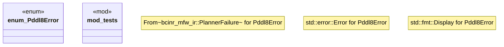

# `crates/bcinr-pddl/src/error.rs`

Source SHA-256: `6dace69587fcc4d53bea67c1c74d77427349f52b01be3d17083cf64a8f656556`

## Dependencies

- `bcinr_mfw_ir::PlannerOutcome`
- `bcinr_mfw_ir::{ BoundHit, BoundKind, Digest, ExhaustionWitness, PlannerFailure, SearchProfileId, }`
- `super::*`

## Standing

- Structural parse: `ALIVE`
- Runtime behavior: `UNKNOWN`
