# `crates/bcinr-pddl/src/execute.rs`

Source SHA-256: `6085fdd3ced671bde3196ed7ea32510f34a7f4b0adf3279cdaa76a491358e3e7`

```mermaid
classDiagram
    class struct_Ctx {
      <<struct>>
      +"kernel: Kernel"
      +"pred_ids: HashMap~String"
      +"term_ids: HashMap~String"
      +"next_pred: u32"
      +"next_rule: u32"
      +"epoch: u64"
    }
    class fn_execute_tape {
      <<fn>>
    }
    class fn_load_may_fire_rule {
      <<fn>>
    }
    class fn_hex {
      <<fn>>
    }
    class fn_hash_strings {
      <<fn>>
    }
    class fn_validate_case_id {
      <<fn>>
    }
    class fn_atom_key {
      <<fn>>
    }
    class fn_apply_pddl_effect_propositional {
      <<fn>>
    }
    class fn_parse_action_label {
      <<fn>>
    }
    class fn_compute_plan_chain {
      <<fn>>
    }
    class struct_SubstageNs {
      <<struct>>
      +"fact_load_ns: u128"
      +"query_ns: u128"
      +"effects_apply_ns: u128"
      +"proof_receipt_build_ns: u128"
      +"trace_build_ns: u128"
    }
    class fn_execute_temporal_plan_instrumented {
      <<fn>>
    }
    class fn_execute_temporal_plan {
      <<fn>>
    }
    note "Ctx"
```

## Dependencies

- `blake3::Hasher`
- `crate::error::Pddl8Error`
- `prolog8::{ Atom8 as P8Atom, Catalog, CatalogId, EpochId, FactBlock8, FactRow8, FeatureBit, Kernel, PredicateId, PredicateMeta, PredicateProofPolicy, ProofMode, QueryAtom8, QueryResult, Rule8, RuleId, SourceId, TermId, }`
- `std::collections::{BTreeSet, HashMap}`
- `std::time::Instant`
- `wasm4pm_compat::ocel::{ OCELAttributeValue, OCELEvent, OCELEventAttribute, OCELObject, OCELRelationship, OCELType, OCELTypeAttribute, OCEL, }`
- `wasm4pm_compat::pddl::Pddl8Atom`
- `wasm4pm_compat::pddl::{ Pddl8Domain, Pddl8ExecutionLog, Pddl8ExecutionReceipt, Pddl8GroundAtom, Pddl8Problem, Pddl8StepResult, Pddl8Tape, PddlEffect, TemporalExecutionReceipt, TemporalPlan, }`

## Standing

- Structural parse: `ALIVE`
- Runtime behavior: `UNKNOWN`
