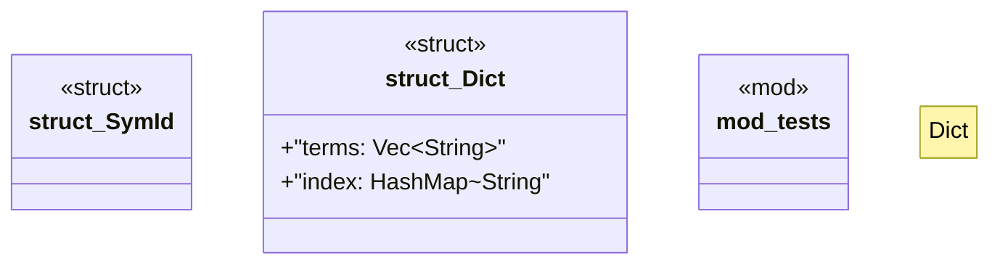

# `crates/bcinr-pddl/src/ground/dict.rs`

Source SHA-256: `50198ae8ad6c79042baf11b617771b490e74afb368a4303d86af15689fc23999`

## Dependencies

- `std::collections::HashMap`
- `super::*`

## Standing

- Structural parse: `ALIVE`
- Runtime behavior: `UNKNOWN`
