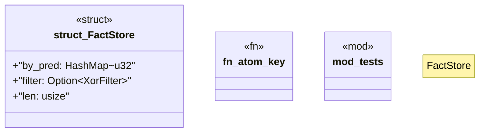

# `crates/bcinr-pddl/src/ground/facts.rs`

Source SHA-256: `19d70824ff7fe0007c40f2d420fc7c62f550003471b91c5752ba91c30cc386a7`

## Dependencies

- `crate::ground::dict::Dict`
- `crate::ground::dict::SymId`
- `crate::ground::xorf::XorFilter`
- `std::collections::{BTreeSet, HashMap}`
- `super::*`

## Standing

- Structural parse: `ALIVE`
- Runtime behavior: `UNKNOWN`
