# `crates/bcinr-pddl/src/ground/lazy.rs`

Source SHA-256: `b303ea68e1ddd027ac63fcec1b63f38a2ee2710f2a5bdaa7076e1640b518d2bc`

```mermaid
classDiagram
    class struct_GroundStats {
      <<struct>>
      +"candidate_groundings: usize"
      +"materialized_groundings: usize"
      +"reachable_atoms: usize"
    }
    class struct_TypeIndex {
      <<struct>>
      +"object_type: HashMap~String"
      +"parent: HashMap~String"
    }
    class struct_SchemaPlan {
      <<struct>>
      +"schema: &'a Pddl8ActionSchema"
      +"cand_ids: Vec~Vec~u32~~"
      +"param_index: HashMap~String"
    }
    class struct_IndexedGroundProblem {
      <<struct>>
      +"initial_state: BTreeSet~Pddl8GroundAtom~"
      +"goal: Vec~Pddl8GroundAtom~"
      +"actions: Vec~Pddl8GroundAction~"
      +"action_index: HashMap~Pddl8GroundAtom"
      +"always_applicable: Vec~usize~"
      +"stats: GroundStats"
    }
    class type_Binding {
      <<type>>
    }
    class fn_join_bindings {
      <<fn>>
    }
    class fn_atom_is_closed {
      <<fn>>
    }
    class fn_close_atom {
      <<fn>>
    }
    class fn_try_extend {
      <<fn>>
    }
    class fn_expand_unbound {
      <<fn>>
    }
    class fn_ground_atom_ids {
      <<fn>>
    }
    class fn_instantiate {
      <<fn>>
    }
    class fn_intern_atom {
      <<fn>>
    }
    class fn_insert_ground {
      <<fn>>
    }
    note "GroundStats"
    note "IndexedGroundProblem"
    note "SchemaPlan~"
    note "TypeIndex"
```

## Dependencies

- `bcinr_mfw_ir::{ BoundHit, BoundKind, Digest, ExhaustionWitness, PlannerOutcome, SearchProfileId, }`
- `std::collections::{BTreeSet, HashMap, HashSet, VecDeque}`
- `super::dict::{Dict, SymId}`
- `super::facts::FactStore`
- `wasm4pm_compat::pddl::{ Pddl8ActionSchema, Pddl8Atom, Pddl8Domain, Pddl8GroundAction, Pddl8GroundAtom, Pddl8Problem, Pddl8Tape, PDDL8_MAX_GROUND, PDDL8_MAX_PLAN_DEPTH, }`

## Standing

- Structural parse: `ALIVE`
- Runtime behavior: `UNKNOWN`
