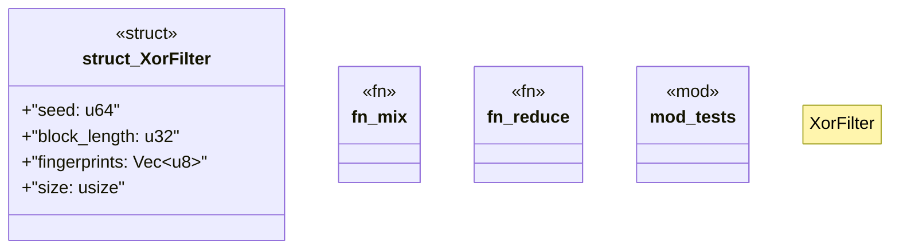

# `crates/bcinr-pddl/src/ground/xorf.rs`

Source SHA-256: `5c8207a2e51180fe58dced27cbadeb7e3d824001de3f9e735f0caa78f2caf461`

## Dependencies

- `super::*`

## Standing

- Structural parse: `ALIVE`
- Runtime behavior: `UNKNOWN`
