# `crates/bcinr-pddl/src/lib.rs`

Source SHA-256: `c79e0b03e2df35b4d22ed290954c63ab00127adff6d97bb1618bae17d0c6b6da`

```mermaid
classDiagram
    class mod_alloc_counter {
      <<mod>>
    }
    class mod_capability {
      <<mod>>
    }
    class mod_capability_router {
      <<mod>>
    }
    class mod_causal {
      <<mod>>
    }
    class mod_concurrency {
      <<mod>>
    }
    class mod_consequence {
      <<mod>>
    }
    class mod_dfcm_crown {
      <<mod>>
    }
    class mod_error {
      <<mod>>
    }
    class mod_execute {
      <<mod>>
    }
    class mod_ground {
      <<mod>>
    }
    class mod_llm_bridge {
      <<mod>>
    }
    class mod_mfw {
      <<mod>>
    }
    class mod_parse {
      <<mod>>
    }
    class mod_powl_bridge {
      <<mod>>
    }
    class mod_schedule_analysis {
      <<mod>>
    }
    class mod_search {
      <<mod>>
    }
```

## Dependencies

- `capability::{ admit_planning_task, AdmittedPlanningTask, CapabilityProfile, DefaultCapabilityProfile, GroundedPlanningEpoch, PddlFeature, SemanticSupport, ALL_PDDL_FEATURES, }`
- `capability_router::{ route_capability_plan, CapabilityRouteReceipt, CapabilityTask, CostVector, DesiredEffect, }`
- `causal::{CausalAnalysisError, PddlCausalAnalyzer}`
- `concurrency::{ConcurrencyAnalysisError, PddlConcurrencyAnalyzer}`
- `consequence::{ plan_with_standing_cache, ConsequenceHorizon, ExactStateKey, GoalReachabilityHorizon, MakespanObservation, MinimumMakespanHorizon, PlanningResult, ResidualDecision, ResidualObligation, Residualizer, StandingConsequenceCache, }`
- `dfcm_crown::{run_dfcm_crown_suite, DfcmBenchReceipt}`
- `error::{Pddl8Error, PlannerOutcome}`
- `execute::{ compute_plan_chain, execute_tape, execute_temporal_plan_instrumented, SubstageNs, }`
- `ground::{GroundDurativeAction, GroundProblem, GroundTemporalProblem}`
- `llm_bridge::{ admit_candidate_domain, admit_candidate_problem, manufacture_world, AdmittedDomain, AdmittedProblem, WorldManufactureReceipt, }`
- `mfw::{ q_lens, FrontierBoxes, FrontierMeasure, MassVector, PositiveDistribution, PositiveMass, QLensError, QValue, WeightedDistribution, }`
- `parse::{domain31_from_pddl, domain_from_pddl, problem31_from_pddl, problem_from_pddl}`
- `schedule_analysis::{ analyze_schedule, analyze_schedule_instrumented, AnalysisSubstageNs, CapacityDelta, ScheduleAnalysis64, }`
- `search::{ ExactBfsRail, ExactSearchRail, ExactStepOutcome, ExploitSearchRail, ExploitStepOutcome, FairRailScheduler, MfwPortfolio, PortfolioOutcome, QLensRail, RailSelection, }`
- `wasm4pm_compat::ocel::{OCELEvent, OCEL}`
- `wasm4pm_compat::pddl::{ DerivedPredicate, DurationConstraint, DurativeAction, Metric, MetricDir, MetricExpr, NumericEffect, NumericExpr, NumericOp, Pddl31Action, Pddl31Domain, Pddl31Problem, Pddl8ActionSchema, Pddl8Atom, Pddl8Domain, Pddl8ExecutionLog, Pddl8ExecutionReceipt, Pddl8GroundAction, Pddl8GroundAtom, Pddl8Problem, Pddl8StepResult, Pddl8Tape, Pddl8TapeOp, PddlCondition, PddlConstraint, PddlEffect, PddlEvent, PddlFunction, PddlPreference, PddlProcess, PddlType, TemporalExecutionReceipt, TemporalPlan, TemporalPlanStep, TimeSpecifier, TimedLiteral, TrajectoryConstraint, PDDL8_MAX_ARITY, PDDL8_MAX_CONJUNCTS, PDDL8_MAX_GROUND, PDDL8_MAX_PARAMS, PDDL8_MAX_PLAN_DEPTH, }`

## Standing

- Structural parse: `ALIVE`
- Runtime behavior: `UNKNOWN`
