# `crates/bcinr-pddl/src/llm_bridge.rs`

Source SHA-256: `529cf45c37b11c063e797672e6b9d31e6795d7792b63a4dbb06a45468343bc8a`

```mermaid
classDiagram
    class struct_AdmittedDomain {
      <<struct>>
      +"domain31: Pddl31Domain"
      +"domain8: Pddl8Domain"
      +"witness: String"
    }
    class struct_AdmittedProblem {
      <<struct>>
      +"problem31: Pddl31Problem"
      +"problem8: Pddl8Problem"
      +"witness: String"
    }
    class struct_WorldManufactureReceipt {
      <<struct>>
      +"domain_name: String"
      +"problem_name: String"
      +"domain_witness: String"
      +"problem_witness: String"
      +"plan: TemporalPlan"
      +"plan_receipt: TemporalExecutionReceipt"
      +"manufacture_chain: String"
      +"admitted: bool"
      +"refusal_reason: Option~String~"
      +"ocel_export: Value"
    }
    class fn_admit_candidate_domain {
      <<fn>>
    }
    class fn_admit_candidate_problem {
      <<fn>>
    }
    class fn_manufacture_world {
      <<fn>>
    }
    class fn_build_ocel_export {
      <<fn>>
    }
    class fn_ground_and_plan {
      <<fn>>
    }
    class fn_compute_domain_witness {
      <<fn>>
    }
    class fn_compute_problem_witness {
      <<fn>>
    }
    class fn_chain_witnesses {
      <<fn>>
    }
    class fn_chain_witnesses_with_goal {
      <<fn>>
    }
    class fn_chain_witnesses_full {
      <<fn>>
    }
    class fn_refused_receipt {
      <<fn>>
    }
    class fn_hex {
      <<fn>>
    }
    class mod_ocel_export_tests {
      <<mod>>
    }
```

## Dependencies

- `blake3::Hasher`
- `crate::error::Pddl8Error`
- `crate::execute::execute_temporal_plan`
- `crate::ground::{GroundProblem, GroundTemporalProblem}`
- `crate::parse::{domain31_from_pddl, domain_from_pddl, problem31_from_pddl, problem_from_pddl}`
- `serde_json::{json, Value}`
- `super::*`
- `wasm4pm_compat::pddl::{ Pddl31Domain, Pddl31Problem, Pddl8Domain, Pddl8Problem, TemporalExecutionReceipt, TemporalPlan, }`

## Standing

- Structural parse: `ALIVE`
- Runtime behavior: `UNKNOWN`
