# `crates/bcinr-pddl/src/mfw/mod.rs`

Source SHA-256: `7282e9361d3cc787775d17a1c401137af557f40390d72c1f2a450673501bd01b`

```mermaid
classDiagram
    class mod_planner {
      <<mod>>
    }
    class struct_QValue {
      <<struct>>
    }
    class struct_PositiveMass {
      <<struct>>
    }
    class enum_QLensError {
      <<enum>>
    }
    class struct_PositiveDistribution {
      <<struct>>
      +"entries: Vec~(K"
    }
    class struct_WeightedDistribution {
      <<struct>>
      +"entries: Vec~(K"
    }
    class fn_q_lens {
      <<fn>>
    }
    class struct_MassVector {
      <<struct>>
      +"unresolved_goal_mass: f64"
      +"candidate_action_mass: f64"
      +"semantic_novelty_mass: f64"
      +"resource_pressure_mass: f64"
      +"temporal_pressure_mass: f64"
      +"cache_novelty_mass: f64"
    }
    class trait_FrontierMeasure {
      <<trait>>
      +"measure(&self) -~ MassVector"
    }
    class struct_FrontierBoxes {
      <<struct>>
      +"boxes: BTreeMap~K"
    }
    class mod_tests {
      <<mod>>
    }
    note "FrontierBoxes~K~"
    note "MassVector"
    note "PositiveDistribution~K~"
    note "PositiveMass"
    note "QValue"
    note "WeightedDistribution~K~"
    note "std::error::Error for QLensError"
    note "std::fmt::Display for QLensError"
```

## Dependencies

- `proptest::prelude::*`
- `std::collections::BTreeMap`
- `super::*`

## Standing

- Structural parse: `ALIVE`
- Runtime behavior: `UNKNOWN`
