# `crates/bcinr-pddl/src/mfw/planner.rs`

Source SHA-256: `ddbd7c82addd4f4395c44b8ded521b0eeca4fea9fab7184ff7e9ff6a70a0628d`

```mermaid
classDiagram
    class enum_MfwPlanError {
      <<enum>>
    }
    class struct_ValidatedPlan {
      <<struct>>
      +"tape: Pddl8Tape"
      +"result: PlanningResult"
      +"goal_reached: bool"
    }
    class struct_PlannedWorkflow {
      <<struct>>
      +"epoch: GroundedPlanningEpoch"
      +"validated_plan: ValidatedPlan"
      +"causal_plan: CausalPlan"
      +"concurrency: ExecutableConcurrencyComplex"
      +"powl_model: bcinr_powl::model::PowlModel"
      +"projection_receipt: ProjectionReceipt"
      +"planning_receipt: PlanningReceipt"
      +"cache_hit: bool"
    }
    class struct_MfwPlanner {
      <<struct>>
      +"cache: StandingConsequenceCache~H~"
      +"causal_analyzer: CA"
      +"concurrency_analyzer: CO"
      +"projector: PJ"
      +"bounds: EpochBounds"
      +"exploit_q: QValue"
      +"max_gap: usize"
      +"max_ticks: usize"
    }
    class type_DefaultMfwPlanner {
      <<type>>
    }
    class fn_state_digest {
      <<fn>>
    }
    class fn_capability_digest {
      <<fn>>
    }
    class fn_residual_digest {
      <<fn>>
    }
    class fn_measure_frontier {
      <<fn>>
    }
    class fn_bcinr_pddl_positive_distribution {
      <<fn>>
    }
    class fn_occurrences_from_tape {
      <<fn>>
    }
    class mod_tests {
      <<mod>>
    }
    note "MfwPlanner~GoalReachabilityHorizon"
    note "MfwPlanner~H"
    note "std::error::Error for MfwPlanError"
    note "std::fmt::Display for MfwPlanError"
```

## Dependencies

- `bcinr_mfw_ir::{ CausalAnalyzer, CausalPlan, ConcurrencyAnalyzer, ExecutableConcurrencyComplex, PlannerFailure, PlannerOutcome, PowlProjector as PowlProjectorTrait, }`
- `bcinr_mfw_ir::{Digest, EpochBounds}`
- `bcinr_powl_receipt::planning::{ seal_planning_receipt, ComputeEvidence, PlannerOutcomeTag, PlanningReceipt, }`
- `bcinr_powl_receipt::projection::{ digest_powl_model, seal_projection_receipt, ProjectionReceipt, }`
- `crate::capability::DefaultCapabilityProfile`
- `crate::capability::{ admit_planning_task, AdmittedPlanningTask, CapabilityProfile, GroundedPlanningEpoch, ALL_PDDL_FEATURES, }`
- `crate::causal::{CausalAnalysisError, PddlCausalAnalyzer}`
- `crate::concurrency::{ConcurrencyAnalysisError, PddlConcurrencyAnalyzer}`
- `crate::consequence::{ ConsequenceHorizon, GoalReachabilityHorizon, PlanningResult, ResidualDecision, Residualizer, StandingConsequenceCache, }`
- `crate::error::Pddl8Error`
- `crate::ground::GroundProblem`
- `crate::mfw::{q_lens, MassVector, PositiveMass, QValue}`
- `crate::parse::{domain31_from_pddl, domain_from_pddl, problem31_from_pddl, problem_from_pddl}`
- `crate::search::{ExactBfsRail, MfwPortfolio, PortfolioOutcome, QLensRail}`
- `std::collections::BTreeMap`
- `super::*`
- `wasm4pm_compat::pddl::{Pddl8GroundAction, Pddl8Tape}`

## Standing

- Structural parse: `ALIVE`
- Runtime behavior: `UNKNOWN`
