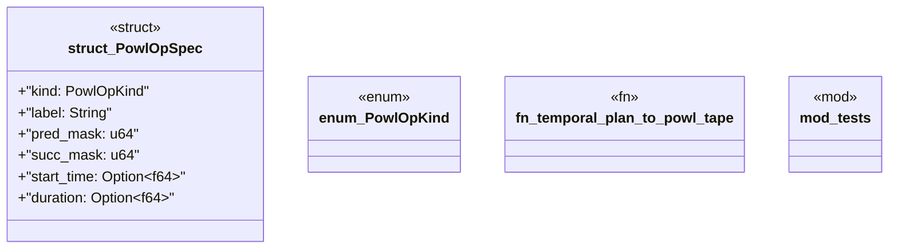

# `crates/bcinr-pddl/src/powl_bridge.rs`

Source SHA-256: `e13ec903edea513787cc0f53e57480f5ba05ed031246e648e8c788f7bf5fce5f`

## Dependencies

- `crate::error::Pddl8Error`
- `super::*`
- `wasm4pm_compat::pddl::TemporalPlan`

## Standing

- Structural parse: `ALIVE`
- Runtime behavior: `UNKNOWN`
