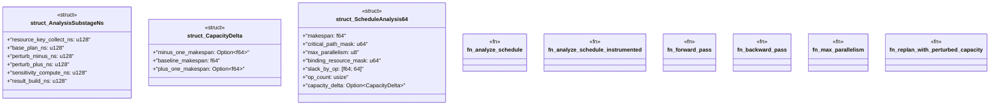

# `crates/bcinr-pddl/src/schedule_analysis.rs`

Source SHA-256: `db39be9c4eff75f60fea02a774dd5bd2db9e28461dd0367841e8a53201022a38`

## Dependencies

- `crate::Pddl8Error`
- `crate::ground::GroundTemporalProblem`
- `crate::powl_bridge::{temporal_plan_to_powl_tape, PowlOpSpec}`
- `std::time::Instant`

## Standing

- Structural parse: `ALIVE`
- Runtime behavior: `UNKNOWN`
