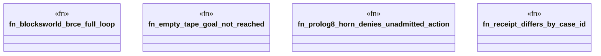

# `crates/bcinr-pddl/tests/brce_loop.rs`

Source SHA-256: `0c810732d96b735891dbb9f098de140af816ab29c54a84ae996e726edcee1570`

## Dependencies

- `bcinr_pddl::{domain_from_pddl, execute_tape, problem_from_pddl, GroundProblem, Pddl8Error}`
- `std::collections::BTreeSet`
- `wasm4pm_compat::pddl::Pddl8GroundAtom`
- `wasm4pm_compat::pddl::Pddl8Tape`

## Standing

- Structural parse: `ALIVE`
- Runtime behavior: `UNKNOWN`
