# `crates/bcinr-pddl/tests/capacity.rs`

Source SHA-256: `5c9ac470bc0a1577abb3f2c451d63c5e5dcea57b4bafaebe4bbd7a0dad7247fb`

```mermaid
classDiagram
    class fn_problem_with_capacity {
      <<fn>>
    }
    class fn_assign_worker_intervals {
      <<fn>>
    }
    class fn_intervals_overlap {
      <<fn>>
    }
    class fn_capacity_one_forces_sequential {
      <<fn>>
    }
    class fn_capacity_two_allows_concurrent {
      <<fn>>
    }
    class fn_schedule_analysis_capacity_one_is_binding_and_sequential {
      <<fn>>
    }
    class fn_schedule_analysis_capacity_two_allows_full_parallelism {
      <<fn>>
    }
    class fn_duplicate_action_labels_admit_identically_to_a_single_label {
      <<fn>>
    }
    class fn_same_instance_is_never_scheduled_twice_while_in_flight {
      <<fn>>
    }
```

## Dependencies

- `bcinr_pddl::{ analyze_schedule, domain_from_pddl, execute::execute_temporal_plan, problem_from_pddl, GroundTemporalProblem, }`

## Standing

- Structural parse: `ALIVE`
- Runtime behavior: `UNKNOWN`
