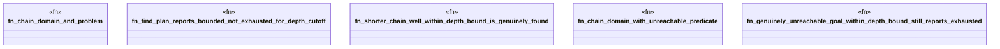

# `crates/bcinr-pddl/tests/depth_bound_exhaustion_conflation.rs`

Source SHA-256: `d779f1fcf172949b28406607d3c1e7dee3ad976921e7aa3d9871c17afe16d541`

## Dependencies

- `bcinr_mfw_ir::BoundKind`
- `bcinr_mfw_ir::PlannerOutcome`
- `bcinr_pddl::ground::GroundProblem`
- `bcinr_pddl::parse::{domain_from_pddl, problem_from_pddl}`

## Standing

- Structural parse: `ALIVE`
- Runtime behavior: `UNKNOWN`
