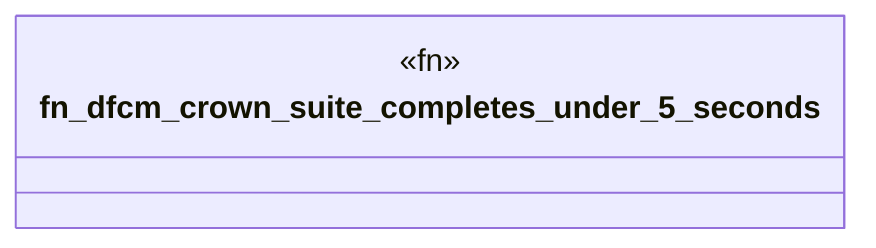

# `crates/bcinr-pddl/tests/dfcm_crown_suite.rs`

Source SHA-256: `adb5e9a445db854e63ec8bb84b14d1b83cfa29621fe2fbd5418ad6afcdb7f24c`

## Dependencies

- `bcinr_pddl::run_dfcm_crown_suite`

## Standing

- Structural parse: `ALIVE`
- Runtime behavior: `UNKNOWN`
