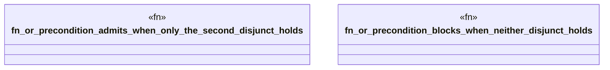

# `crates/bcinr-pddl/tests/durative_disjunction.rs`

Source SHA-256: `581d2b761ffd166a33b827fc26910d36ed2b535e8ed01d0d14c4820c5a5490c4`

## Dependencies

- `bcinr_pddl::{domain_from_pddl, problem_from_pddl, GroundTemporalProblem}`

## Standing

- Structural parse: `ALIVE`
- Runtime behavior: `UNKNOWN`
