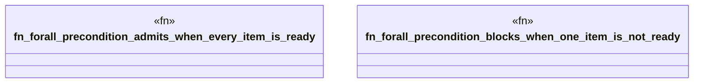

# `crates/bcinr-pddl/tests/durative_quantifiers.rs`

Source SHA-256: `9b18cf32dc4cde9e25d21fd02603066bba7617e4ade717f669b713c7f4e2a680`

## Dependencies

- `bcinr_pddl::{domain_from_pddl, problem_from_pddl, GroundTemporalProblem}`

## Standing

- Structural parse: `ALIVE`
- Runtime behavior: `UNKNOWN`
