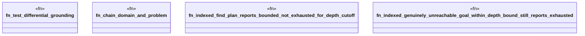

# `crates/bcinr-pddl/tests/indexed_grounding.rs`

Source SHA-256: `0e23243c2406f60211d76512f5e649f69d2153809161fd76bbf06e8489865d10`

## Dependencies

- `bcinr_mfw_ir::BoundKind`
- `bcinr_pddl::ground::lazy::IndexedGroundProblem`
- `bcinr_pddl::{domain_from_pddl, problem_from_pddl, GroundProblem}`

## Standing

- Structural parse: `ALIVE`
- Runtime behavior: `UNKNOWN`
