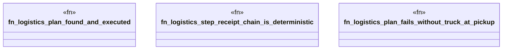

# `crates/bcinr-pddl/tests/logistics.rs`

Source SHA-256: `98bebd77e35c3f77cf99af0074d7d0cc14d45204324d5df6ef85dfd562218b67`

## Dependencies

- `bcinr_pddl::{domain_from_pddl, execute_tape, problem_from_pddl, GroundProblem}`
- `std::collections::BTreeSet`
- `wasm4pm_compat::pddl::Pddl8GroundAtom`

## Standing

- Structural parse: `ALIVE`
- Runtime behavior: `UNKNOWN`
