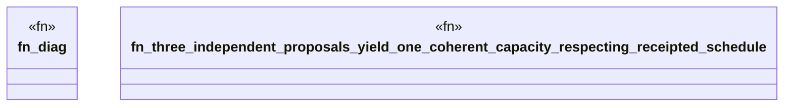

# `crates/bcinr-pddl/tests/proposer_substrate.rs`

Source SHA-256: `96f1e896bb8b4e9f87c9af477cab5b1f67b3da5212292b6be1b388599f591735`

## Dependencies

- `bcinr_pddl::{ analyze_schedule, compute_plan_chain, domain_from_pddl, execute::execute_temporal_plan, problem_from_pddl, GroundTemporalProblem, }`
- `chicago_tdd_tools::core::governance::{ Diagnostic, DiagnosticCategory, DiagnosticCode, DiagnosticSink, RunSummary, Severity, }`
- `chicago_tdd_tools::observability::ocel::OcelCollector`
- `std::collections::HashMap`
- `std::path::PathBuf`

## Standing

- Structural parse: `ALIVE`
- Runtime behavior: `UNKNOWN`
