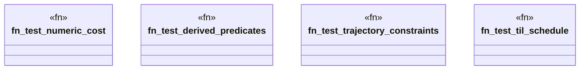

# `crates/bcinr-pddl/tests/semantic_falsifier.rs`

Source SHA-256: `967692b50b201ac57f9c2864f90bdc6a451abd440430587598f2de9811b7e418`

## Dependencies

- `bcinr_pddl::GroundTemporalProblem`
- `bcinr_pddl::{domain_from_pddl, problem_from_pddl, GroundProblem}`

## Standing

- Structural parse: `ALIVE`
- Runtime behavior: `UNKNOWN`
